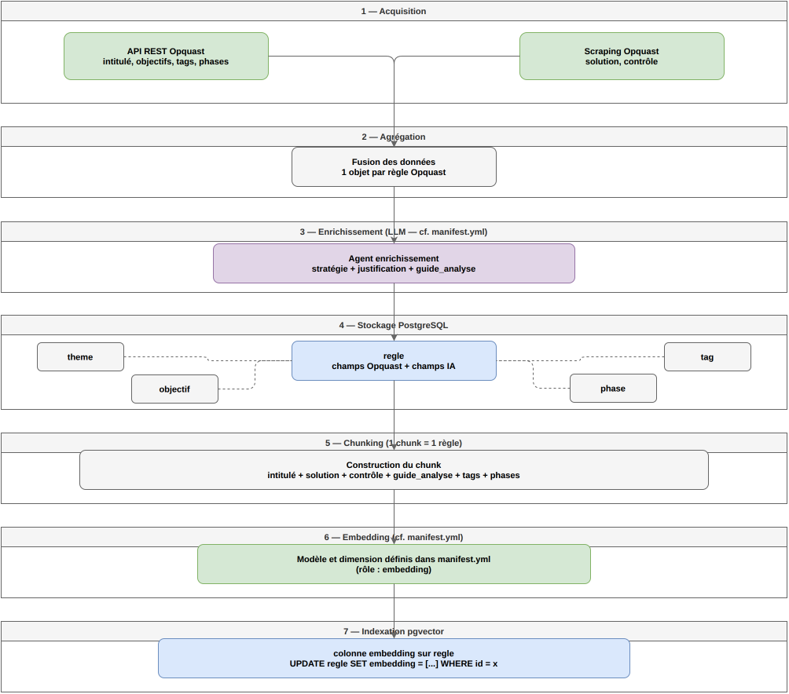

\newpage

## Vue d'ensemble

Le pipeline d'ingestion est un script autonome exécuté en dehors de
l'interface web. Il prépare le référentiel Opquast pour qu'il soit
exploitable par les agents IA lors des audits. Il se déroule en 7 étapes
séquentielles, depuis l'acquisition des données jusqu'à l'indexation
vectorielle dans PostgreSQL.



*cf. [Annexe C — Pipeline d'ingestion](../annexes/C_pipeline_ingestion.png)*

Les données Opquast sont acquises depuis deux sources complémentaires : l'API
REST publique pour les champs structurés, et un scraping des pages publiques
pour les champs `solution` et `contrôle` non encore exposés par l'API. Un
agent LLM enrichit chaque règle en une seule inférence, produisant la
stratégie d'analyse, le score de confiance et le `guide_analyse`. Les règles
sont ensuite stockées en PostgreSQL, chunkées avec tous leurs champs
dénormalisés, vectorisées via All MiniLM L12 v2, et indexées dans pgvector.

En post-MVP, le même script pourra être lancé avec `--mode reingest` pour la
re-ingestion avec injection des feedbacks terrain.

Le script Python est autonome, exécutable en ligne de commande, rejouable à
tout moment. Il traite les 245 règles du référentiel Opquast en séquence et
ne nécessite aucune intervention humaine pendant l'exécution.

```text
Acquisition → Agrégation → Enrichissement LLM → Stockage PostgreSQL
→ Chunking → Embedding → Indexation pgvector
```

## Étape 1 — Acquisition

- **API REST Opquast** (publique) : intitulé, objectifs, tags, thématiques, phases projet
- **Scraping complémentaire** (BeautifulSoup / Playwright) : champs `solution` et `contrôle`

Ce mix API + scraping répond directement à l'exigence C1 du référentiel RNCP37827.

## Étape 2 — Agrégation

Fusion en mémoire des données issues des deux sources. Les règles incomplètes sont loggées et exclues sans bloquer les autres.

## Étape 3 — Enrichissement par agent LLM

Un **agent unique** traite chaque règle en un seul appel LLM. Le prompt demande une réponse en JSON strict :

```json
{
  "strategie_analyse": "statique | playwright | manuel",
  "strategie_justification": "explication courte",
  "guide_analyse": "instruction précise pour l'agent d'audit"
}
```

**En post-MVP (`--mode reingest`)**, le prompt sera enrichi avec les feedbacks terrain accumulés pour que le LLM révise sa classification et son `guide_analyse`.

## Étape 4 — Stockage PostgreSQL

Insertion dans `regle` et tables associées. En mode reingest : mise à jour ciblée des règles sous le seuil uniquement.

## Étape 5 — Chunking

```text
intitulé + solution + contrôle + guide_analyse + tags + phases
```

Texte dénormalisé : le vecteur capture la sémantique complète, sans jointures SQL au retrieval.

## Étape 6 — Embedding

Appel à **Azure `text-embedding-3-small`** — vecteur de 1536 dimensions.

> **Correction du 2026-08-29** : l'hypothèse de départ (All MiniLM L12 v2 via
> Infomaniak, 384 dimensions, gratuit) s'est révélée inutilisable — son
> `max_token_input` de 128 tokens aurait tronqué jusqu'à 86 % du contenu des
> règles les plus longues. Pivot réel vers Azure `text-embedding-3-small`
> (exécuté le 2026-07-26, 245/245 règles, 0,0016 €). Détail complet de
> l'écart : `docs/problemes_rencontres/ingestion/6_embedding_minilm_disqualifie.md`.
> Cible production (Infomaniak) toujours non tranchée à ce jour.

## Étape 7 — Indexation pgvector

```sql
UPDATE regle SET embedding = [...] WHERE id = x
```

Pas de base vectorielle externe — PostgreSQL joue les deux rôles.
