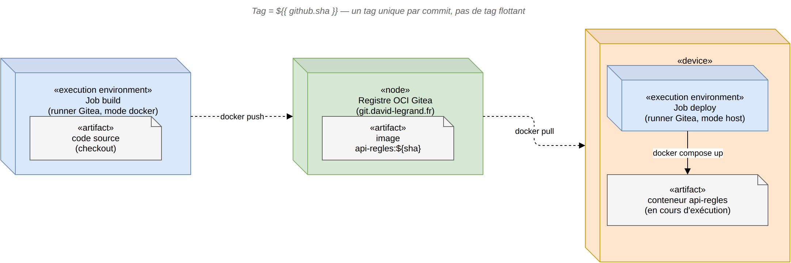

# CD staging sur Gitea Actions : pipeline image (build → registre → déploiement)

2026-08-30 · conception validée, implémentation à venir

## Contexte

L'essai non destructif de migration vers Gitea
(`jury/decisions/2026-08-29-hebergement-git-gitea.md`) a validé `ci-dev.yml`
sur la branche `dev` : job de tests, sans déploiement réel. `cd-staging.yml`
est d'une autre nature — il déploie réellement sur `cloclo` (conteneurs
Docker, fichiers servis par Caddy) — et la décision Gitea notait déjà qu'un
simple copier-coller suffirait puisque `runs-on: [self-hosted, cloclo]`
correspond déjà à un label existant du runner.

En pratique, un copier-coller pur perpétue le mode de déploiement actuel :
clone du dépôt puis build direct de l'image sur la machine cible
(`make up` → `docker compose up -d --build`). Ce mode ne prépare rien pour la
bascule de `main` vers l'hébergement Infomaniak (déjà actée comme un besoin
réel, cf. `docs/developpement/ci.md`), qui nécessitera de déployer sur une
machine distincte de celle qui construit l'image.

## Décision

Faire évoluer `cd-staging.yml` (côté Gitea uniquement — `cd-staging.yml`
GitHub reste inchangé et actif tant que l'essai n'est pas validé) vers un
pipeline **image** : une image `api-regles` est construite et poussée vers le
registre de conteneurs OCI intégré à Gitea, puis tirée pour être déployée —
même si build et déploiement s'exécutent aujourd'hui sur la même machine
(`cloclo`). Le pipeline est conçu **comme si** les deux étapes étaient sur des
machines distinctes (aucun raccourci qui profiterait de leur colocalisation
actuelle, ex. réutilisation du cache de build local) : c'est ce qui le rend
directement réutilisable pour la bascule Infomaniak plus tard.

## Schéma

*Job `build` : construit l'image et la pousse vers le registre. Registre OCI
Gitea : stocke l'image, aucun déploiement n'y a lieu (`«node»`, pas
`«execution environment»`). Job `deploy` : tire l'image et démarre le
conteneur — ne reconstruit jamais l'image lui-même.*

## Architecture

**Job `build`** (nouveau, `runs-on: ubuntu-latest` → conteneur docker via
`act_runner`) :

1. Checkout
2. `docker login git.david-legrand.fr` (secrets `GITEA_REGISTRY_USER` /
   `GITEA_REGISTRY_TOKEN` — jeton Gitea scope `package: écriture`)
3. `docker build -t git.david-legrand.fr/david/qualicheck-api-regles:${{ github.sha }} .`
4. `docker push git.david-legrand.fr/david/qualicheck-api-regles:${{ github.sha }}`

**Job `deploy`** (`needs: build`, `runs-on: [self-hosted, cloclo]`) — reprend
les étapes de l'actuel `cd-staging.yml`, avec ces changements :

- Le `.env` écrit depuis les secrets reçoit une ligne de plus :
  `API_REGLES_IMAGE=git.david-legrand.fr/david/qualicheck-api-regles:${{ github.sha }}`
- `docker login` (même registre) avant toute manipulation d'image
- `docker compose pull api-regles` puis `make up-staging` (nouvelle cible,
  sans `--build`) remplace `make up`
- Migrations Alembic, attente de santé de l'API, rejeu de la suite
  d'acceptance, build et publication du client `regles_api_client` :
  inchangés

**Tag** : SHA du commit (`${{ github.sha }}`) uniquement — pas de tag
flottant `staging`. Traçabilité exacte de ce qui tourne, rollback possible
vers n'importe quel commit passé en repointant `API_REGLES_IMAGE`.

## Composants à modifier

- `.gitea/workflows/cd-staging.yml` (nouveau, dans le dépôt) : deux jobs
  décrits ci-dessus.
- `Makefile` (dans le dépôt) : nouvelle cible `up-staging` (`docker compose
  up -d`, sans `--build`) — `make up` reste inchangé pour le développement
  local, qui doit continuer à builder directement.
- `docker-compose.override.yml` (sur `cloclo`, hors dépôt,
  `/srv/docker/qualicheck-staging-override/`) : le service `api-regles`
  reçoit `image: ${API_REGLES_IMAGE}` en plus du réseau `cloudnet` déjà
  présent.
- Secrets Actions Gitea du dépôt `qualicheck` : `GITEA_REGISTRY_USER`,
  `GITEA_REGISTRY_TOKEN` (nouveaux, en plus des secrets déjà en place pour
  `ci-dev.yml`).

## Gestion des erreurs

- Si `docker push` échoue (job `build`) : le job `deploy` ne démarre pas
  (`needs: build`), aucune tentative de déploiement sur une image absente du
  registre.
- Si `docker compose pull` échoue (job `deploy`, ex. image absente ou
  problème réseau vers le registre) : le déploiement s'arrête avant toute
  migration ou redémarrage de conteneur — pas de risque de repartir sur une
  version incohérente.
- Le garde-fou existant (rejeu de la suite d'acceptance après démarrage)
  reste inchangé et continue de couvrir les régressions fonctionnelles,
  indépendamment de l'origine de l'image (build local vs image tirée).

## Hors périmètre

- Bascule effective de `main`/Infomaniak sur ce même modèle : pas traitée
  ici, seulement préparée (le pipeline sera transposable tel quel).
- Politique de rétention/nettoyage des images poussées sur le registre
  Gitea (une image par commit, jamais purgée) : à traiter si l'espace disque
  devient un problème réel, pas avant.
