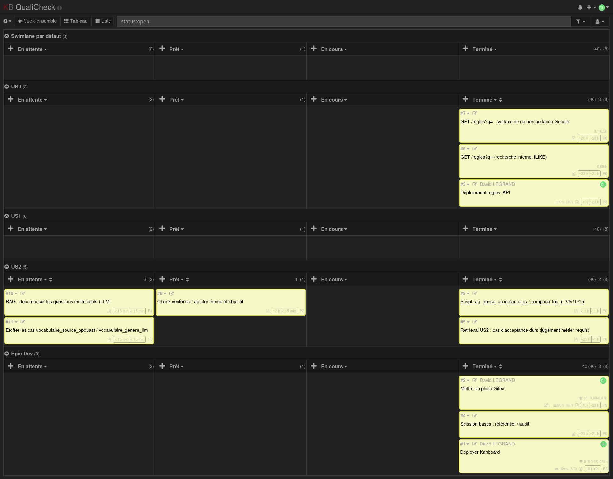

## Avancées

- État au 2026-07-21 (`jury/README.md`) : méthode incrémentale documentée (`CHANGELOG.md`, `TODO.md`), outils de pilotage agile encore à formaliser.
- **2026-08-29** — Décision actée : Kanboard auto-hébergé (`kanban.david-legrand.fr`) pour le pilotage — burndown natif, relations de tâches bloquantes natives, plugin AgileIndicators pour priorité/complexité. Raisonnement complet et alternatives écartées (Notion, Trello, Planka) : `jury/decisions/2026-08-29-outil-pilotage-kanban.md`.
- **2026-08-29** — Kanboard **déployé réellement** sur `cloclo` (Docker + Caddy, en-têtes de sécurité alignés sur les autres domaines), connexion admin confirmée. Plugin `AgileIndicators` restant à activer.
- Rituels agiles classiques restent hors périmètre, jugés difficiles à faire exister honnêtement en solo + assistant IA — limite assumée, pas résolue.
- **2026-09-09** — Kanboard utilisé en conditions réelles pour piloter le
  chantier retrieval US2 (Étapes 2-4.1 : jeu d'acceptance à 5 familles,
  mesure `recall@3/5/10/15`, recommandations de suite). Capture du board
  (swimlane US2) à ce moment :
  `jury/avancees_competences/captures/2026-09-09-kanboard-board-us2.png` —
  cartes #5/#9 terminées (jeu d'acceptance, script de mesure), #8/#10/#11
  ouvertes (recommandations issues de la mesure, priorités et estimations
  renseignées). Première preuve d'un cycle complet mesure → décision →
  cartes de suite tracé dans l'outil.

